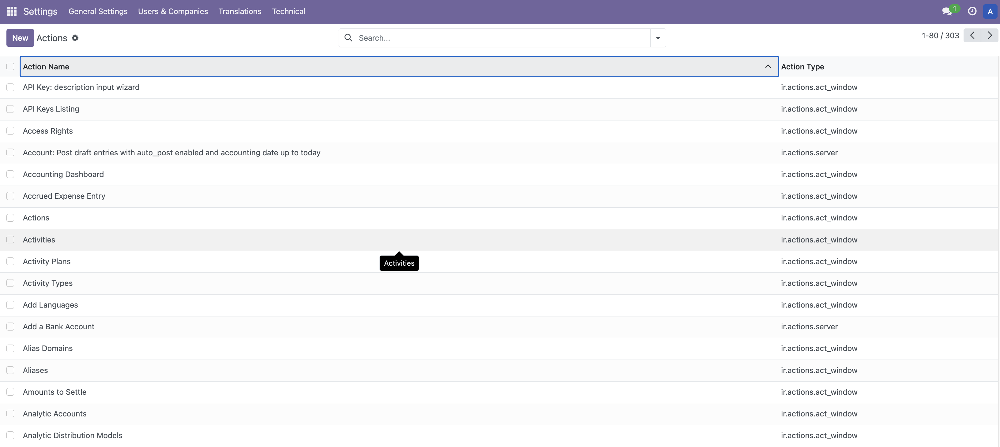

# ODOO Documentation


# Introduction
# Installation

# Tutorials

## Types of Actions in Odoo
Actions in Odoo are responsible for activities which are done by the users and the system response. These responses are actually known as actions. Actions in Odoo ERP actually defines the behavior of the system in response to user actions. 

There are various types of actions available in Odoo
- Server Actions (`ir.actions.server`)
- Window Actions (`ir.actions.act_window`)
- URL Actions (`ir.actions.act_url`)
- Client Actions (`ir.actions.client`)
- Report Actions (`ir.actions.report`)
- Automated Actions (`ir.cron`)

All those actions are stored in Odoo database table `ir.actions.actions`. When we call a method like a button method which refers to actions it returns directly as dictionaries.

All the user defined actions are available in **Settings->Technical->Actions**.



In all actions there are several fields available  

**Mandatory Fields**  
- **Name**: Name of the action, it display on the client interface.
- **Action Type**: Action type is Where we define the type or category of the current action.

**Optional Fields**  
- res_model, 
- binding_model_id, 
- binding_view_types, 
- view_id, 
- view_ids, 
- view_mode, 
- view_type, 
- search_view_id, 
- state, 
- code, 
- domain, 
- context, 
- target


Server Actions (`ir.actions.server`)  
`ir.actions.server` represents the server actions model. Server action works on a base model and offers various types of actions that can be executed automatically.

The available server actions are:

- Execute Python Code: Written python code that will be executed
- Create a new Record: Create a new record with values.
- Write on a Record: Update the record values.
- Execute several actions: Which trigger several server actions.


* model_id: Model on which the server actions run. Example: `purchase.model_purchase_order`.  
* binding_model_id : It defines which model is bound to this action.  
* binding_view_types : Mostly list / form is used to represent this field.  
* state: Options are,
  * code: Executes python code given in the argument  of code.
  * object_create: It creates a new record.
  * object_write: Update the current record.
  * multi: Executes several actions given in the argument of child_ids.

* code: Field to write python code which the action will execute.
some predefined variables can be used in this field while writing the python code.
    * env: odoo environment variable
    * model: model object linked to the action 
    * record: record on which the action is triggered, can be void.
    * records: recordset of all records which the action is triggered in multi-mode, can be void.
    * Also available DateTime, dateutil, time, timezone like python modules.
    * log for logging function and  Warning for raise warning.

```xml
<record id="action_account_invoice_from_list" model="ir.actions.server">
    <field name="name">Register Payment</field>
    <field name="model_id" ref="account.model_account_move"/>
    <field name="groups_id" eval="[(4, ref('account.group_account_invoice'))]"/>
    <field name="binding_model_id" ref="account.model_account_move"/>
    <field name="binding_view_types">list</field>
    <field name="state">code</field>
    <field name="code">
        if records:
            action = records.action_register_payment()
    </field>
</record>
```


Window Actions (`ir.actions.act_window`)  
This is the most common type action, it triggers a different view of the model and in other words it is  used to visualize the models with different types of views.

* res_model : Model for representing this action window.
* res_id : It is used to pass the active id of res_model.
* view_mode : List of view types separated by commas(no spaces), ie, kanban, tree, form.
* view_id : Provide the default view type will be open when the action is executed. If there is nothing it will open the window with the view of first type in the view_mode.
* view_ids : We can define specific views for specific view_mode.
* search_view_id : Setting the default search view for the object.
* context : Used to pass additional context data passed to view.
* domain : Condition used to filter the data passed to view.
* target : We can define different options for target windows.

  * new : It opens a window with a new address and edit mode(as when creating wizards) .
  * current : It opens the regular form views.
  * fullscreen : It will open the window in fullscreen mode.
  * main : Without breadcrumb, it opens the main content area.
  * inline : It will open the window in edit mode.


URL Actions (`ir.actions.act_url`)  

Client Actions (`ir.actions.client`)  
`ir.actions.client`` represents the client action model. Client actions basically trigger the actions implemented by the client. These are basically menu-items defined in XML and the corresponding actions are mapped to a widget.


Report Actions (`ir.actions.report`)  

Automated Actions (`ir.cron`)  


# References:

## Source Code
- 

## Documentation
- https://www.cybrosys.com/blog/types-of-actions-in-odoo
- https://www.globalteckz.com/different-types-of-actions-in-odoo/